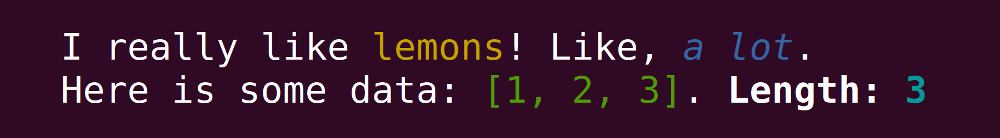

# Bunt: simple macro-based terminal colors and styles

[](https://github.com/LukasKalbertodt/bunt/actions?query=workflow%3ACI+branch%3Amaster)
[](https://crates.io/crates/bunt)
[](https://docs.rs/bunt)


`bunt` offers macros to easily print colored and formatted text to a terminal.
It is just a convenience API on top of [`termcolor`](https://crates.io/crates/termcolor).
`bunt` is implemented using procedural macros, but it does not depend on `syn` and its compilation is fairly quick (≈1.5s on my machine, including all dependencies).

*Minimum Supported Rust Version*: 1.46.0

```rust
// Style tags will color/format text between the tags.
bunt::println!("I really like {$yellow}lemons{/$}! Like, {$blue+italic}a lot{/$}.");

// To style a single argument, you can also use the `{[style]...}` syntax. This
// can be combined with style tags.
let v = vec![1, 2, 3];
bunt::println!("Here is some data: {[green]:?}. {$bold}Length: {[cyan]}{/$}", v, v.len());
```

<p align="center">
    </img>
</p>

See [**the documentation**](https://docs.rs/bunt) for more information.

## Status of this project

This is still a young project, but I already use it in two applications of mine.
The syntax is certainly not final yet.
[Seeking feedback from the community!](https://github.com/LukasKalbertodt/bunt/issues/1)


<br />

---

## License

Licensed under either of <a href="LICENSE-APACHE">Apache License, Version
2.0</a> or <a href="LICENSE-MIT">MIT license</a> at your option.
Unless you explicitly state otherwise, any contribution intentionally submitted
for inclusion in this project by you, as defined in the Apache-2.0 license,
shall be dual licensed as above, without any additional terms or conditions.
